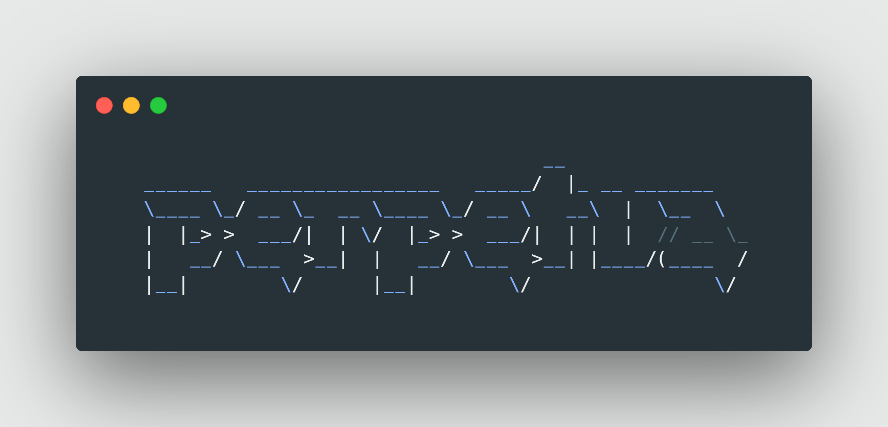

# perpetua

  

    本项目为 OneBot 协议实现下机器人实例与用户服务间第三方消息代理中间件。通过 WebSocket 代理与额外的 WebAPI 接口，提供单一QQ账号下多端接入，事件回调、消息互通等功能实现。并配备常规流量治理功能包括服务注册发现、熔断限流、负载均衡。

    <a alt="Protocol" href="https://github.com/botuniverse/onebot-11"><image src="https://img.shields.io/badge/OneBot-v11-green"></image></a>
    <a alt="NTQQ" href="https://github.com/LagrangeDev/Lagrange.Core"><image src="https://img.shields.io/badge/Lagrange-OneBot-blue"></image></a>

   <a alt="License" href="https://www.gnu.org/licenses/agpl-3.0.en.html"><image src="https://img.shields.io/badge/license-AGPLv3-4EB1BA.svg"></image></a>
   <a alt="Release" href="https://github.com/IUnlimit/lagrange-go-distributed/releases"><image src="https://img.shields.io/github/release/IUnlimit/lagrange-go-distributed.svg"></image></a>
   <a alt="Actions" href="https://github.com/IUnlimit/perpetua/actions"><image src="https://github.com/IUnlimit/perpetua/workflows/CI/badge.svg"></image></a>

   <a href="https://iunlimit.github.io/perpetua/">[文档]</a>

### 注意事项

本项目内置了NTQQ实现（`Lagrange.OneBot`）的分发与运行，您需自行解决签名服务器的配置问题。若您在使用时有任何疑问，随时欢迎进群咨询。Group: [863522624](https://qm.qq.com/cgi-bin/qm/qr?k=Xby1-vbC43Hgv4TXd8LcI889zEhwkq_a&jump_from=webapi&authKey=SmcLCk3eBSQyC0ylq9CiwTafuDk7ls+5QrNDB2//hjTZY6sCTdCz/RKzRwVRrN4J)

### 适配平台

- [x] Linux
- [x] MacOS
- [x] Windows

### 协议支持

> `perpetua` 作为服务端时，其他客户端需要使用特定的 [API](https://iunlimit.github.io/perpetua/#/zh-cn/user/enhance-api?id=get_ws_port-获取分配的ws端口) 通过服务发现才能使用资源。为了兼容第三方服务，`perpetua` 也提供了作为客户端主动提供服务资源的实现。  

> 注意: 由于 `perpetua` 的设计理念，http 代理调用将不会被支持。若您在使用 Http Post 这类依赖回调触发事件的通信协议时有主动调用 API 的需求，请考虑使用其他连接方式（如 Http Post + 正向 WebSocket）实现

- OneBot
  - [x] 正向 WebSocket（非标准形式）
  - [x] 反向 WebSocket
  - [x] Http Post
- Satori
  - [ ] WebAPI

### 拓展支持

- [x] 服务注册与发现
- [ ] 自动重启与断点续传 (client -> NTQQ)
- [ ] 负载均衡
- [ ] 熔断限流

### 拓展实现

拓展 API

| API                          | 功能                                                                                                                      |
|------------------------------|-------------------------------------------------------------------------------------------------------------------------|
| get_ws_port                  | [获取分配的ws端口](https://iunlimit.github.io/perpetua/#/zh-cn/user/enhance-api?id=get_ws_port-获取分配的ws端口)                      |
| get_online_clients           | [获取当前在线客户端列表](https://iunlimit.github.io/perpetua/#/zh-cn/user/enhance-api?id=get_online_clients-获取当前在线客户端列表)           |
| set_restart                  | [重启 OneBot 实现](https://iunlimit.github.io/perpetua/#/zh-cn/user/enhance-api?id=set_restart-重启-onebot-实现)                |
| set_client_name              | [设置当前客户端名称](https://iunlimit.github.io/perpetua/#/zh-cn/user/enhance-api?id=set_client_name-设置当前客户端名称)                  |
| send_broadcast_data          | [发送客户端广播数据](https://iunlimit.github.io/perpetua/#/zh-cn/user/enhance-api?id=send_broadcast_data-发送客户端广播数据)              |
| send_broadcast_data_callback | [发送客户端广播数据回调](https://iunlimit.github.io/perpetua/#/zh-cn/user/enhance-api?id=send_broadcast_data_callback-发送客户端广播数据回调) |

[获取分配的ws端口]: #
[获取当前在线客户端列表]: #
[重启 OneBot 实现]: #
[设置当前客户端名称]: #
[发送客户端广播数据]: #
[发送客户端广播数据回调]: #

### 通信 SDK

| 语言 / 平台 | 名称                                                                         | 简介     | 通信协议支持 |
|---------|----------------------------------------------------------------------------|--------|--------|
| Java    | [perpetua-sdk-for-java](https://github.com/IUnlimit/perpetua-sdk-for-java) | 官方社区实现 | Java   |

### 致谢
- 感谢原机器人社区的贡献者：†白可乐、Alan Zhao、[@fred913](https://github.com/fred913)
- 感谢 [@Thexiaoyuqaq](https://github.com/Thexiaoyuqaq)、小豆子、阿丽塔、polar、一口小雨、黑土、仔仔 等用户在测试、策划方面提供的帮助与支持
