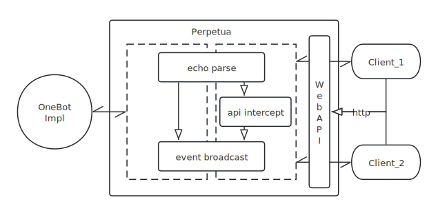
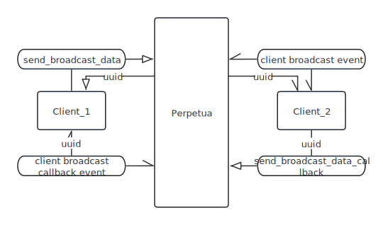

# 介绍

## 简介

> 注意：项目目前仅支持第三方 `NTQQ` 协议实现框架 `Lagrange.OneBot`

本项目为 `OneBot` 协议实现下机器人实例与用户服务间第三方消息代理中间件。通过 `WebSocket` 代理与额外API接口，提供单一QQ账号下多端接入，事件回调、消息互通等功能实现。并配备常规流量治理功能包括服务注册发现、熔断限流、负载均衡。

## 基本原理

`Perpetua` 以 `OneBot` 协议提供的正向 `WebSocket` 连接为基础，通过协议中规定的 `echo` 字段作标识，将不同连接的发送与回调进行区分，再配合拓展的 `WebAPI` 接口，完成各独立连接间的行为配合。

其架构图如下: 

当各客户端间进行通信时，其流程图如下: 

## 声明

- 若您在使用时有任何疑问，欢迎入群讨论咨询 QQ: 863522624

- 若您为 Minecraft 公益服主且服务器资源难以承受 perpetua 的运行，欢迎 [联系我] 。我与我的云服务很乐意为您提供一份力所能及的援助。

更新时间 {docsify-updated}